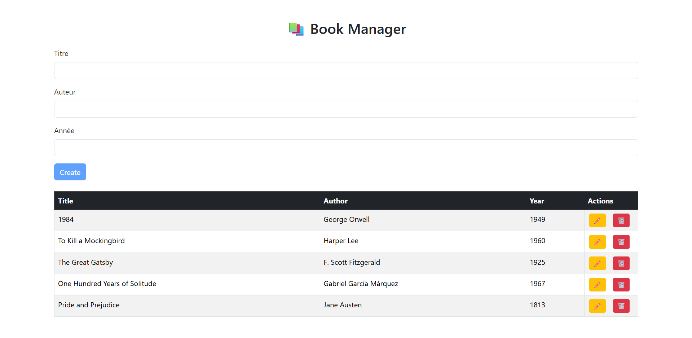

# 📚 BookManager – Application de Gestion de Livres



Ce projet est composé de deux parties :

- **Frontend Angular (`book-ui`)** – pour l’interface utilisateur.
- **Backend Django (`bookmanager`)** – pour l’API REST.

---

## 📁 Structure du projet

```
project-root/
├── book-ui/            # Frontend Angular
│   ├── src/app/
│   └── ...
├── bookmanager/        # Backend Django
│   ├── manage.py
│   └── ...
├── .gitignore
├── recruitment.txt     # = requirements.txt pour Django
└── README.md
```

---

## 🚀 Installation

### Prérequis

- Node.js (v18+ recommandé)
- Angular CLI (`npm install -g @angular/cli`)
- Python 3.10+
- PostgreSQL (ou SQLite pour tests)

---

### 🛠 Installation backend (Django)

```bash
cd bookmanager
python -m venv env
source env/bin/activate  # ou .\env\Scripts\activate sous Windows
pip install -r recruitment.txt
python manage.py migrate
python manage.py runserver
```

Par défaut, le serveur Django tourne sur [http://127.0.0.1:8000](http://127.0.0.1:8000)

---

### 🧩 Installation frontend (Angular)

```bash
cd book-ui
npm install
ng serve
```

L’interface est accessible à [http://localhost:4200](http://localhost:4200)

---

## 📦 Fonctionnalités principales

### Angular (`book-ui`)

- Affichage de la liste des livres
- Formulaire d’ajout et de modification de livre
- Suppression avec modal
- Intégration avec une API Django REST

### Django (`bookmanager`)

- Endpoints API REST pour gérer les livres
- Base de données relationnelle (SQLite ou PostgreSQL)
- Configuration avec Django REST Framework

---

## 🔌 Endpoints API (exemple)

| Méthode | Endpoint        | Description              |
|---------|------------------|--------------------------|
| GET     | /api/books/      | Liste des livres         |
| POST    | /api/books/      | Ajouter un livre         |
| GET     | /api/books/:id/  | Détails d’un livre       |
| PUT     | /api/books/:id/  | Modifier un livre        |
| DELETE  | /api/books/:id/  | Supprimer un livre       |

---

## ✅ To-do (pour amélioration)

- Authentification avec JWT
- Pagination / filtres sur la liste des livres
- Déploiement (Heroku, Vercel, Render...)
